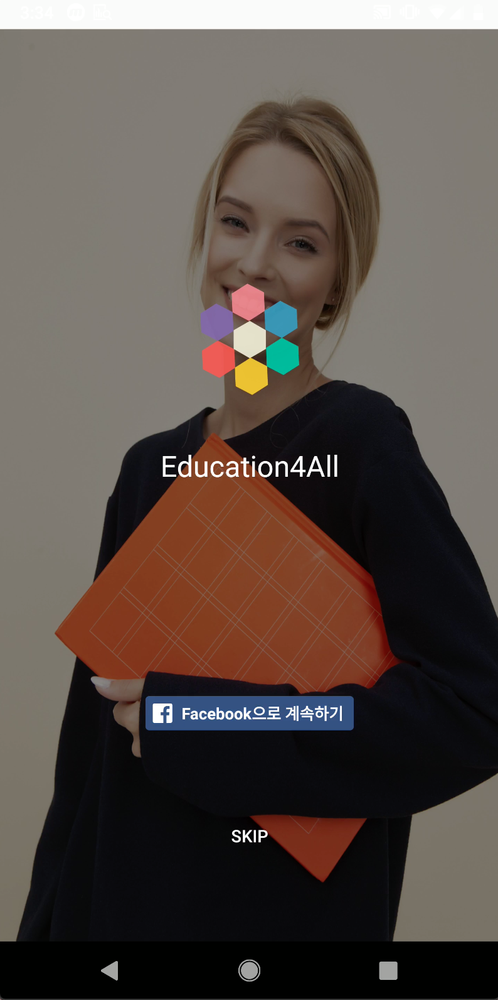

# Education4All

**by Team Ms.Torch**

  
  
  

 
 

## App Download
https://github.com/f8-education4all/education4all-android/blob/master/app/release/app-release.apk
 
 

 

> Facebook login can be skipped with skip button like the screen above !

 
 
 
Last day, someone at the Facebook presentations catechized the audience with this quote:'Nobody cares how much you know until they know how much you care', Theodore Roosevelt

"When we teach someone how to read and write, it affects the person throughout his or her life. And the positive effects extend to families, friends, and communities. This is the goal we are aiming for."

## Inspiration
 Billions of people in the world don't have the least literacy skills, and billions of pre-schoolers don’t have the school education for literacy in now. An illiterate person is a high possibility of falling into poverty or deteriorating health. and becoming increasingly isolated in a technology-driven world. They are also apt to fail to use social facilities such as travel, voting, and even hospitals and likely to fall into a vicious circle of poverty. So for example, people tradeoff their voting rights, in order to get shelter, food and all.  

 If we leave these people alone, our society not only loses valuable human resources, it also makes our society impoverished and negative. The gap between rich and poor is bigger, the unbalanced growth between the regions are growing up. Practical education measures targeting illiterate people can reduce social costs in the long run.

 Most of the illiterate people live in developing countries. However, Citizens of developing countries don’t have performant devices and available network. It is necessary for the coexistence of nations on earth. So, we want to make the world better to support people of developing countries to gain a self-sustaining capability by providing our application.

## What it does
### Education Mobile Application for the people of illiteracy

**Object Detection (using MobileNet)**
- Detect object and display its name in English
- Vocalize the detected word

**Text Recognition (using RCNN)**
- Detect sentences in a book
- Vocalize the detected sentences

## How we built it
**Training Part** Caffe2, Tensorflow, Keras

**Conversion Part** TFLiteConverter, Mobile exporter

**Inference Part** Android Native

**Deep Learning**
- Applying both PyTorch and Tensorflow for performance comparison

**Mobile**
- Caffe2 on Mobile, Tensorflow Lite, ML Kit
- FaceBook Auth Login
- Internal Database using SQLite (Serverless)
- Android TTS (Text-To-Speech)

## Challenges we ran into
- Optimizing to the environment of developing countries

In order to optimize the environment of developing countries, the mobile application is configured to be available without the Internet. All deep-learning model inference and dictionary functions are done by using memory and CPU resources inside the device without a server or a network.

- Generating Caffe2 pb files for mobile

Applying Caffe2 to mobile requires a complicated process of extracting the pb file after exporting the PyTorch-based code to Caffe2. There were many errors and challenges in that processes.

- Optimizing performance on mobile

When applied to mobile, the performance was compared by creating a structure that allows the model to be served in two directions, Caffe2 and Tensorflow, to optimize performance.

## Accomplishments that we're proud of
* We were two to develop the mobile application, but we master two different languages, Java and Kotlin, and we were able to collaborate, each with its programming language, to coexist java and Kotlin. The result was great!
  *being able to create an application in a small amount of time that can change the world for lots of persons. 
* We were able to develop the two main modules of our application in the given time despite various difficulties
* Our greatest achievement has been to work together and develop a tool that will be useful to many.

## What we learned
Being part of an international team is a great privilege, we are from all over the world, South Korea, Tunisia, Haiti. So, we did not only learn about each other's cultures but also the way to share knowledge, work together and manage to create something using a cut edge technology in Artificial Intelligence for people around the world and especially in Africa. We learned how to use frameworks like Pytorch in a very short amount of time and how to integrate pytorch models into a mobile  application. 

## What's next for Education 4 All
**Deep Learning**
- Retrain CRNN OCR Model for better accuracy
- Expanding label lists of MobileNet by retraining the model for more diversities of detected objects
- Federated learning using mobile for being customized into developing countries’ real environments

**Mobile**
- Built-in dictionary for multilingual translation services
- Optimizing frame rates for better UX
